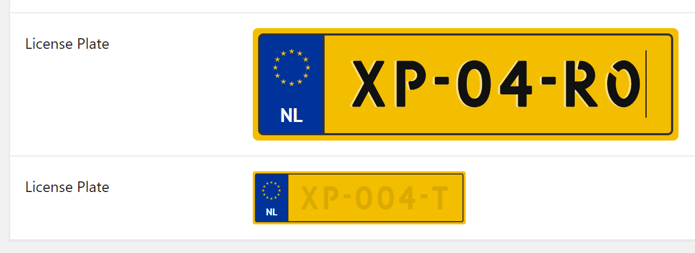

# CMB2 Dutch License Plate Field
<!-- ALL-CONTRIBUTORS-BADGE:START - Do not remove or modify this section -->
[](#contributors-)
<!-- ALL-CONTRIBUTORS-BADGE:END -->
Adds a Dutch License Plate Field to CMB2.
## Usage
Use `dutch_license_plate_small` for the small license plate field or `dutch_license_plate_large` for the large license plate field.
```php
$license_plate = new_cmb2_box( array(
    'title' => __('License Plate', 'amex-dutch-license-plate'),
    'id'    => 'license_plate'
));

$license_plate_number = $license_plate->add_field(array(
    'name' => __( 'License Plate', 'amex-dutch-license-plate'),
    'id'   => 'dutch_license_plate_small',
    'type' => 'dutch_license_plate_small'
));
```

## Screenshot


# License
The code and the documentation are released under the [MIT License](LICENSE).

## Contributors ✨

Thanks goes to these wonderful people ([emoji key](https://allcontributors.org/docs/en/emoji-key)):

<!-- ALL-CONTRIBUTORS-LIST:START - Do not remove or modify this section -->
<!-- prettier-ignore-start -->
<!-- markdownlint-disable -->
<table>
  <tr>
    <td align="center"><a href="https://www.linkedin.com/in/patrick-groot/"><br /><sub><b>Patrick Groot</b></sub></a><br /><a href="https://github.com/automex/cmb2-dutch-license-plate-field/commits?author=pgroot91" title="Code">💻</a></td>
  </tr>
</table>

<!-- markdownlint-enable -->
<!-- prettier-ignore-end -->
<!-- ALL-CONTRIBUTORS-LIST:END -->

This project follows the [all-contributors](https://github.com/all-contributors/all-contributors) specification. Contributions of any kind welcome!

## Credits

This plugin makes use of a license plate formatter created by @koenoe https://github.com/koenoe/kentekenplaat

The font used for the licenseplate field is "Kenteken" from LeFly Fonts http://lefly.vepar.nl/